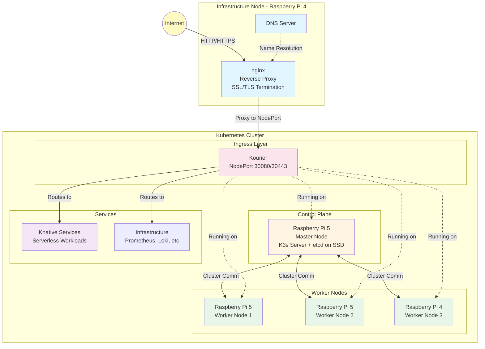

# Home Kubernetes Cluster

This repository contains the configuration and setup for a home Kubernetes cluster running on Raspberry Pi hardware.

## Hardware Setup

### Cluster Nodes

- **3x Raspberry Pi 5**
  - 1x Master node (with 1TB SSD)
  - 2x Worker nodes
- **2x Raspberry Pi 4**
  - 1x nginx + DNS service
  - 1x Worker node

**Total: 5 Raspberry Pi devices**

### Storage Configuration

**Master Node (Pi 5) - 1TB SSD:**
- 200GB partition: K3s etcd database
- 800GB partition: MinIO object storage

### Architecture



## Services

### Core Infrastructure (External to K8s)
- **DNS Server**: Internal DNS resolution for `.home` domain (Raspberry Pi 4)
  - Resolves all `*.home` to nginx
  - Uses dnsmasq for lightweight DNS
  - Examples: `grafana.home`, `prometheus.home`, `minio.home`
  - No manual DNS entries needed for new services
- **nginx**: External reverse proxy and SSL/TLS termination (Raspberry Pi 4)
  - Routes traffic to Kourier NodePort
  - Single entry point for all external traffic
  - Load balances across all K8s nodes

### Kubernetes Components
- **K3s Master Node**: Lightweight K8s control plane (API server, scheduler, controller manager)
- **K3s Worker Nodes**: Application workload execution (3 nodes)

### Deployed Infrastructure Services

#### Ingress
- **Kourier**: Lightweight ingress controller for Knative
  - Exposed via NodePort (30080/30443)
  - Handles Knative service routing
  - Integrated with external nginx

#### Observability Stack
- **Prometheus**: Metrics collection and monitoring
- **Grafana Alloy**: Telemetry data collector
- **Loki**: Log aggregation system
- **Grafana**: Unified visualization dashboards

#### Storage
- **MinIO**: S3-compatible distributed object storage

#### Serverless
- **Knative Serving**: Serverless container platform
- **Knative Eventing**: Event-driven application support

## Directory Structure

```
.
├── k8s-init/              # K3s installation and cluster initialization scripts
│   ├── README.md          # Detailed setup instructions
│   ├── setup-ssd.sh       # SSD partitioning script
│   ├── install-master.sh  # Master node installation script
│   ├── install-worker.sh  # Worker node installation script
│   └── init-cluster.sh    # Complete cluster initialization
│
└── k8s-infrastructure/    # Infrastructure and supporting services
    ├── README.md          # Infrastructure services documentation
    ├── dns-config/        # DNS server configuration for Pi 4
    │   ├── README.md      # DNS setup guide
    │   ├── dnsmasq.conf   # Main DNS configuration
    │   ├── home-domain.conf # .home domain settings
    │   ├── hosts.home     # Static host entries
    │   └── setup-dns.sh   # Automated setup script
    ├── nginx-config/      # nginx configuration for external Pi 4
    │   ├── README.md      # nginx setup and configuration guide
    │   └── kourier-proxy.conf # Proxy configuration for Kourier ingress
    ├── observability/     # Monitoring and logging stack
    │   ├── prometheus/    # Metrics collection
    │   ├── alloy/         # Telemetry collector
    │   ├── loki/          # Log aggregation
    │   └── grafana/       # Visualization dashboards
    ├── storage/
    │   └── minio/         # S3-compatible object storage
    └── serverless/
        └── knative/       # Serverless platform (with Kourier)
```

## Prerequisites

- Raspberry Pi OS (64-bit recommended)
- Static IP addresses configured for all nodes
- SSH access to all Raspberry Pi devices
- Network connectivity between all nodes
- Sufficient storage on each node (minimum 32GB SD card)

## Quick Start

### 1. Setup SSD on Master Node

First, partition and mount the 1TB SSD on the master node:

```bash
cd k8s-init
scp setup-ssd.sh pi@<master-ip>:~/
ssh pi@<master-ip>
sudo ./setup-ssd.sh
```

This creates optimized storage for etcd (200GB) and MinIO (800GB).

### 2. Cluster Initialization

Initialize your K3s cluster using the automated scripts:

```bash
cd k8s-init
./init-cluster.sh
```

This will install K3s on the master node and all worker nodes. For detailed instructions and manual setup, see [k8s-init/README.md](./k8s-init/README.md).

### 3. Configure DNS (on Pi 4)

Set up DNS for the `.home` domain on the Raspberry Pi 4:

```bash
# Copy DNS config to Pi 4
scp -r k8s-infrastructure/dns-config pi@<pi4-ip>:~/

# SSH to Pi 4 and run setup
ssh pi@<pi4-ip>
cd dns-config
sudo ./setup-dns.sh
```

This configures dnsmasq to resolve all `*.home` domains to nginx. See [k8s-infrastructure/dns-config/README.md](./k8s-infrastructure/dns-config/README.md) for details.

### 4. Deploy Infrastructure Services

After the cluster is running, deploy the supporting infrastructure:

```bash
cd k8s-infrastructure

# Create namespaces
kubectl create namespace monitoring
kubectl create namespace storage
kubectl create namespace knative-serving

# Deploy services (in order)
kubectl apply -f storage/minio/
kubectl apply -f observability/prometheus/
kubectl apply -f observability/loki/
kubectl apply -f observability/alloy/
kubectl apply -f observability/grafana/
kubectl apply -f serverless/knative/
```

For detailed configuration and deployment options, see [k8s-infrastructure/README.md](./k8s-infrastructure/README.md).

### 5. Configure External nginx

Configure nginx on Raspberry Pi 4 to route traffic to Kourier:

```bash
# Get Kourier NodePort
kubectl get svc -n knative-serving kourier

# Update kourier-proxy.conf with your node IPs
# Then copy to Pi 4
scp k8s-infrastructure/nginx-config/kourier-proxy.conf pi@<pi4-ip>:~/

# SSH to Pi 4 and configure
ssh pi@<pi4-ip>
sudo cp kourier-proxy.conf /etc/nginx/sites-available/k8s-ingress
sudo ln -s /etc/nginx/sites-available/k8s-ingress /etc/nginx/sites-enabled/
sudo nginx -t && sudo systemctl reload nginx
```

See [k8s-infrastructure/nginx-config/README.md](./k8s-infrastructure/nginx-config/README.md) for detailed instructions.

### 6. Verify Installation

```bash
# Check all nodes are ready
kubectl get nodes

# Verify SSD mounts on master
ssh pi@<master-ip> "df -h | grep -E 'etcd|minio'"

# Test DNS resolution
nslookup grafana.home <pi4-ip>
# Should return nginx IP

# Check infrastructure services
kubectl get pods -A

# Verify Kourier is running
kubectl get pods -n knative-serving

# Test complete flow: DNS → nginx → Kourier
curl http://grafana.home
# or
curl -H "Host: grafana.home" http://<pi4-ip>
```

## Management

### Accessing the Cluster

```bash
# Set KUBECONFIG
export KUBECONFIG=$HOME/.kube/config

# Check cluster status
kubectl get nodes
kubectl get pods --all-namespaces
```

### Deploying Applications

```bash
# Apply manifests
kubectl apply -f manifests/

# Check deployment status
kubectl get deployments
kubectl get services
```

## Monitoring

- Node status: `kubectl get nodes`
- Pod status: `kubectl get pods -A`
- Cluster info: `kubectl cluster-info`

## Networking

K3s comes with Flannel CNI by default:
- Pod Network CIDR: `10.42.0.0/16` (K3s default)
- Service CIDR: `10.43.0.0/16` (K3s default)
- CNI Plugin: Flannel (VXLAN backend)

### Required Ports

**Master Node:**
- 6443/tcp - Kubernetes API Server
- 8472/udp - Flannel VXLAN
- 10250/tcp - Kubelet metrics

**Worker Nodes:**
- 8472/udp - Flannel VXLAN
- 10250/tcp - Kubelet metrics

## Maintenance

### Updating K3s

```bash
# On master node
curl -sfL https://get.k3s.io | sh -

# On each worker node
curl -sfL https://get.k3s.io | K3S_URL=https://<master-ip>:6443 K3S_TOKEN=<token> sh -

# Verify update
kubectl get nodes
```

### Backup

```bash
# Backup K3s (on master node)
sudo k3s etcd-snapshot save

# List snapshots
sudo k3s etcd-snapshot ls

# Restore from snapshot
sudo k3s server --cluster-reset --cluster-reset-restore-path=/var/lib/rancher/k3s/server/db/snapshots/<snapshot>
```

## Troubleshooting

### Common Issues

1. **K3s service not starting**
   ```bash
   # Check K3s logs on master
   sudo journalctl -u k3s -f

   # Check K3s agent logs on worker
   sudo journalctl -u k3s-agent -f
   ```

2. **Nodes not joining cluster**
   - Verify network connectivity: `ping <master-ip>`
   - Check firewall rules allow ports 6443, 8472, 10250
   - Verify node token: `sudo cat /var/lib/rancher/k3s/server/node-token`

3. **Pods not starting**
   - Check node resources: `kubectl describe node <node-name>`
   - Check pod logs: `kubectl logs <pod-name>`
   - Verify images are compatible with ARM64 architecture

4. **DNS resolution issues**
   - Verify CoreDNS is running: `kubectl get pods -n kube-system`
   - Restart CoreDNS: `kubectl rollout restart deployment/coredns -n kube-system`

### Useful Commands

```bash
# Check K3s status
sudo systemctl status k3s         # On master
sudo systemctl status k3s-agent   # On worker

# Restart K3s
sudo systemctl restart k3s        # On master
sudo systemctl restart k3s-agent  # On worker

# View K3s config
sudo cat /etc/rancher/k3s/k3s.yaml

# Check cluster info
kubectl cluster-info dump
```

## Contributing

This is a personal homelab cluster. Feel free to use this setup as reference for your own cluster.

## License

MIT

## Notes

### Hardware Considerations
- Raspberry Pi 5 provides better performance for the master node (improved CPU and RAM)
- Ensure adequate cooling for all Pi devices under load (especially Pi 5)
- Consider power backup/UPS for production-like stability
- Use high-quality SD cards or USB SSDs for better I/O performance

### K3s Benefits for Raspberry Pi
- **Lightweight**: Uses less than half the memory of full K8s
- **Single binary**: Easier to install and update
- **Built-in components**: Includes Flannel, CoreDNS, Traefik by default
- **ARM64 optimized**: Native support for Raspberry Pi architecture

### Best Practices
- Regular automated backups of etcd snapshots
- Monitor resource usage (CPU, memory, disk) on all nodes
- Use ARM64-compatible container images
- Keep K3s version consistent across all nodes
- Document node IP addresses and configurations

## References

- [K3s Official Documentation](https://docs.k3s.io/)
- [K3s GitHub Repository](https://github.com/k3s-io/k3s)
- [Raspberry Pi Kubernetes Guide](https://ubuntu.com/tutorials/how-to-kubernetes-cluster-on-raspberry-pi)
